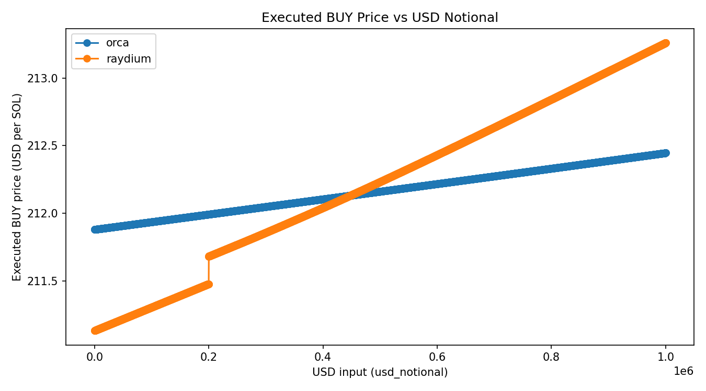

# CLMM Spreads — Orca & Raydium probes

Lightweight, RPC‑only spread/impact probes for **single pools** on Solana:

- **Orca Whirlpools** (Orca CLMM)
- **Raydium CLMM** (`@raydium-io/raydium-sdk-v2`)

They fetch on‑chain pool state + tick arrays, compute **BUY** (USD→BASE exact‑in) and **SELL** (BASE→USD exact‑out) quotes on that pool only, then print a summary and write a CSV.

Quotes use **zero slippage tolerance** in the SDK calls. This measures pool‑native execution at size (fee + curve depth) without adding user‑side buffers.

---

## Quick start

```bash
# 1) install deps
npm i

# 2) build
npm run build
```

---

## Usage

### Raydium CLMM

Example: USDC/SOL pool — print and write CSV over a size range

```bash
node dist/raydium_probe.js \
  --pool 3ucNos4NbumPLZNWztqGHNFFgkHeRMBQAVemeeomsUxv \
  --range 5000:50000:5000 \
  --csv rt_raydium_usdc_sol.csv
```

### Orca Whirlpools

Example: print and write CSV over a size range

```bash
node dist/orca_probe.js \
  --pool Czfq3xZZDmsdGdUyrNLtRhGc47cXcZtLG4crryfu44zE \
  --range 5000:50000:5000 \
  --csv rt_orca_usdc_sol.csv
```

### Orca Whirlpools (USD mode)

This mode executes trades in real USD notionals (e.g. $10, $1000) using the SOL/USD oracle pool for conversion when the quote isn’t USDC.

Example: BTC/SOL pool with USD mode and oracle conversion

```bash
node dist/orca_probe.js \
  --pool 9xE4w8w5eB6g9kqB3Qp9qz7Hj1bZ1JY8gQX9X9X9X9X9 \
  --range 100:1000:100 \
  --usdMode \
  --oraclePool Czfq3xZZDmsdGdUyrNLtRhGc47cXcZtLG4crryfu44zE
```

> **Note:** This mode ensures comparable execution measurements across non‑USDC pools.

---

## Flags

| Flag | Type | Default | Notes |
|---|---|---:|---|
| `--pool` | `string` | *required* | Pool public key (Orca Whirlpool or Raydium CLMM). |
| `--rpc` | `string` | `https://api.mainnet-beta.solana.com` | Use your own RPC for speed / rate limits. |
| `--sizes` | `comma-list` | `100,1000,5000,10000,100000,1000000` | USD notionals (e.g. `--sizes 100,250,1000`). |
| `--range` | `start:end:step` | *none* | Alternative to `--sizes`. Example: `--range 5000:50000:5000`. If both are passed, range wins. |
| `--csv` | `string` | *none* | If set, appends rows to this CSV file (schema below). |
| `--quiet` | `bool` | `false` | Suppress console table; only write CSV rows. |

> **Size semantics:** sizes are interpreted as USD notionals when the quote side is USDC. If quote ≠ USDC, they represent quote‑token notionals, but the column names remain unchanged for compatibility.

---

## CSV schema & column semantics

**Main columns:**
- `wts_utc` — ISO timestamp (UTC) when the quotes were taken.
- `dex` — `"orca"` or `"raydium"`.
- `pool` — Pool pubkey.
- `usd_notional` — Size of the roundtrip in USD (if quote=USDC; otherwise quote‑token notional).
- `mid_usd_per_base` — Mid from on‑chain `sqrt_price_x64` (USD per BASE when quote=USDC; otherwise quote per BASE).
- `buy_px_usd_per_base` — Executed BUY price (USD/BASE) for **USD→BASE** exact‑in.
- `sell_px_usd_per_base` — Executed SELL price (USD/BASE) for **BASE→USD** exact‑out.
- `roundtrip_bps` — `(buy_px_usd_per_base − sell_px_usd_per_base) / mid_usd_per_base * 1e4`.
- `fee_bps_total` — **Roundtrip** fee in bps (`2 × per‑leg taker fee`).
- `impact_bps_total` — AMM curve/tick‑depth component: `max(roundtrip_bps − fee_bps_total, 0)`.

> Additional columns include pool parameters (fee, tick spacing, liquidity, protocol fee) and token metadata (mints, decimals, symbols).

---

## Output anatomy (console)

Each run prints:

1) **Pool Summary** — program id, tick spacing, fee, liquidity, sqrt price, current tick, mints/decimals, mid.  
2) **BUY/SELL rows** — for each notional, executed prices, round‑trip bps, fee bps, and implied impact bps.

Example:
```
RT   $10,000  mid=208.92686694  buy=209.01064408  sell=208.84312288
      rt=8.0182bps  fee=8.0000bps  impact=0.0182bps
```

---

## What the numbers mean

- **BUY** (`USD→BASE exact‑in`) spends the quote side (USDC) and reports the executed price = USD paid / BASE received. Fee is charged on the USD input.
- **SELL** (`BASE→USD exact‑out`) asks for an exact USD amount out and reports the executed price = USD received / BASE spent. Fee is charged on the BASE input.
- **Roundtrip bps** includes both fee legs and price impact from the curve across ticks used.
- **Impact bps** strips out the fee to isolate liquidity/curve slippage at that size.

The results can be graphed on plot:


---

## Assumptions & limitations

- **Single‑pool only.** No routing.
- **Zero slippage tolerance** in SDK quotes (measures pool‑native execution; real trades may add buffers).
- **Large sizes** may cross multiple tick‑arrays; if adjacent arrays are missing/uninitialized via RPC, quotes fail.

---

## License

MIT
